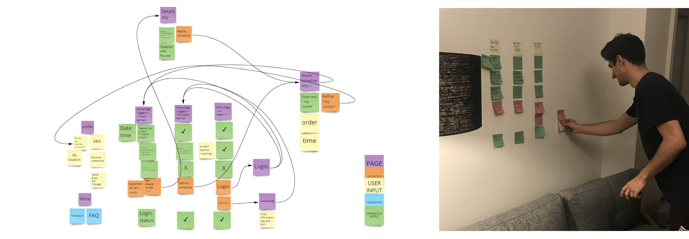
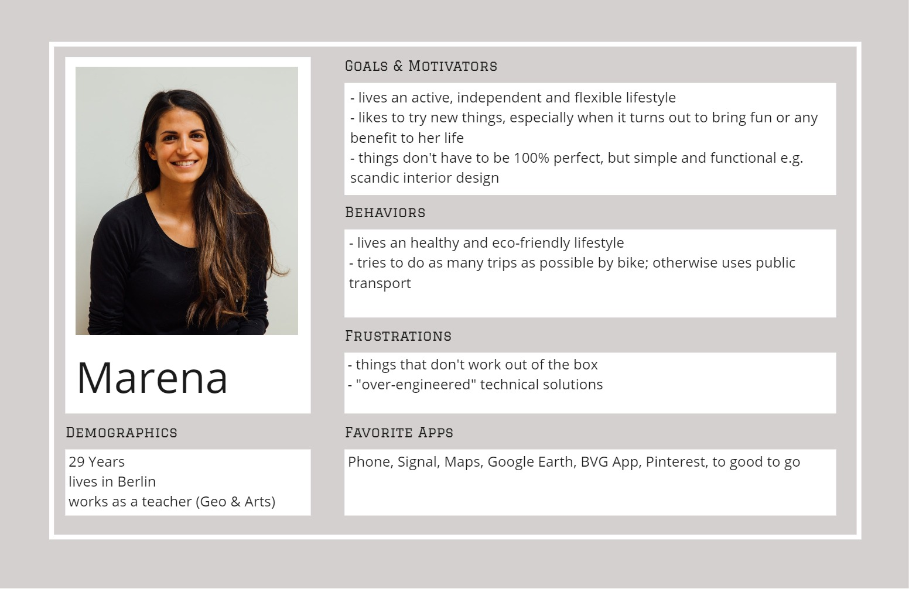
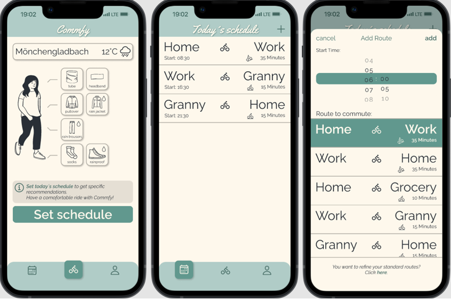

# Blog Post - _Commfy_
_Commfy_ is a mobile app for bike commuters to help them choose suitable bike clothing for their daily rides. _Commfy_ takes the current weather data and its changes throughout the day, as well as the specific routes of each user and his or her personal preferences and characteristics into account. _Commfy_ makes commuting by bike more comfortable and thereby contributes to fostering cycling, reducing traffic and protecting the environment.  
In an interdisciplinary Tech Labs team, students of tracks User Experience Design (UX), Web Development (WD) and Data Science (DS) developed the digital product _Commfy_ from idea to prototype in an 8-week project phase. The team members organized the project and coordinated themselves in a self-responsible way by using appropriate project management tools, always supported by a clear and trust-based communication. In weekly meetings, work results were discussed and appreciated, coordination needs were identified, and the next steps were planned. In addition to a frequent exchange on Slack, the team organized itself by a shared Kanban board. Team _Commfy_ got support throughout the entire process by their mentors, who provided them with suggestions, critical questions and feedback to guide everyone's learning and the project success.

## Team UX: 
The project started for us, Team UX, with the confirmation of the users' needs as assumed in the project pitch. A survey within a group of 33 participants, including 22 bike commuters, showed that there are bike commuting people who have a need and interest in a product like _Commfy_. We then had to define the project´s MVP within the whole team. We agreed on the development of a functional and user-friendly mobile app that provides clothing recommendations for bike commuters based on the user's favorite routes, weather and personal preferences. Based on the MVP, the UX-team worked out features, structures and content of the digital product.  

###### _Informational architecture_

 The created persona _Marena_, derived from the results of the survey, helped defining and detailing the features and main flows of the app:

* Registration, Login, Logout
* Initial setting of standard routes
* Set up the daily schedule
* Clothing recommendations for each route
* Backpack recommendation for the whole day
* User profile
* Feedback option

 

###### _Persona Marena_

 The next step covered the wireframing in a low fid quality and the first user tests. Those enabled iterative optimization and detailing, which was found to be very valuable. The basis for the front end development was given.   

###### _Low fid wireframe_

 After completing those user tests, we started high fidelity wireframing. Beside the user friendly design the focus laid on the visual attractiveness of the product. Minor modifications and final design was confirmed by a second loop of user tests.  

###### _High fid wireframe_  

## Team WD:
Since it was assumed among the project team that _Commfy_ would be used on the smartphone / mobile device, WD made the decision to build a hybrid app using Ionic CLI and React. Ionic also offered the advantage to design the user interface by making use of the Ionic UI Components. Capacitor, a cross-platform app runtime, was chosen as a “bridge” allowing the app to run on a browser. With regards to the programming language, TypeScript was chosen due to the fact that it provides helpful syntax such as interfaces and enumerated types that help shaping the data and make it less error-prone compared to JavaScript.

The backend part was implemented with Google’s Firebase. On the one hand, Firebase is used to enable the authentication of users. On the other hand, Firestore, a document based database and part of Firebase, helps storing user data such as mail address, user preferences or routes. To support form handling e.g. for the signup and registration flow, the library Formik was integrated. For state management, React Query and Jotai are in place. There are two APIs implemented, OpenWeatherAPI to display the current weather data as well as the DS’s API providing an outfit recommendation. To be able to use the APIs, CORSmiddleware from the CORS library is used which intercepts the API requests and creates / changes the header of the response.

The process is illustrated below. It should also be mentioned that the tasks were not always worked on one after the other, but that work was often done in parallel on different challenges, i.e. a back and forth.  

###### _Process Web Dev_  

## Team DS  
The main tasks of the data science team were to build two distinct models that recommend clothing pieces and feet items for a bike commuter. The latter task was conducted to implement newly-acquired knowledge on machine learning and evaluation into practice. The ultimate purpose of the rule-based model project was to provide the web development team with a working API that recommends clothing items with an accuracy of above 70 percent. This blog will elucidate the path we took to deal with the technical problem and methods we equipped ourselves with to reach the main objectives.  

### Framing analytical strategy
The preparatory work consisted of understanding the business problem and converting it into a technical problem. Thus, after a round of discussion with stakeholders, we understood that bike commuters tend to pick erroneous clothing for the ride that eventually makes the experience of commuting by bike uncomfortable. The leading cause of these problems is the reluctance of bike commuters to find data-driven information to decide what to wear due to the cognitive load and time-consuming nature of such effort. Thus, after brainstorming on possibilities of how things should be and work, we decided to build a digital solution that would recommend appropriate clothing for bike commuters. For the DS team, it meant building a rule-based recommendation model based on the most significant features that will have the most influence on the output. Thus, based on common knowledge, we selected five features to predict thirteen outputs for different body parts. 

### Output data   

###### _Output data_
 

### Input data   

###### _Input data_
 

### Rule-based model
 
***Data acquisition and exploratory data analysis (EDA)*** 
After defining the output- and input data, we proceeded with data collection. The data on location and time was consumed from Open Weathermap API with requests library. We invoked the HTTP method Get to retrieve data. Please refer to [this file](https://github.com/TechLabs-Berlin/wt21-commfy/blob/datacleaning_visualisation/DS_Files/Flask_api.py) for more details. Besides, we also created user input data algorithmically to use it as a stand-in to be used for the rule-based recommendation model. 
 
After the data collection, we proceeded with data pre-processing and exploratory data analysis. For this, we conducted a summary of missing data, undertook data cleaning, created a summary table (with df.describe()), plotted bar charts to show frequency of the categories in ‘heaviness of trip,’ ‘sex,’ weather states and applied box plots for wind speed and temperature data separately. 
 
***Developing rule-based model in python based on the logic of decision trees***  
After reaching the model-ready data quality, we sketched out the system of logical rules by incorporating the selected features to produce the output recommendations. Hence, as the primary logic, we constructed the following arithmetic expression, temp + heatperception – (if female ==2) > current_temp, and compared its outcome to a selected threshold corresponding to a clothing piece. The thresholds were picked based on empirical observation (personal experience) and intuition. For more information on the logic of decision trees, click [here](https://drive.google.com/drive/folders/1VWIDjObwMDKEtCoWnFtMQ8w5VrkkK4r1). 

This exercise helped us effectively lay out the clothing options, which served as a solid foundation for discussing with our stakeholders to find the realistic possibilities and most probable outcomes. After refining the logic of decision trees, we extracted the rules and implemented them in the workbook in python by defining functions and constructing rules with if/else clauses. We developed the rule-based model for multiclass multioutput classification problem. 

***Evaluation of the model from a technical and user perspectives*** 
We generated fifteen different weather scenarios and trip situations (combination of six features) for hot, warm, breezy, and cold seasons to ask a user to fill in this table with clothing pieces that s/he would pick for given weather conditions. We compared a user’s clothing selections with clothing recommendations from a rule-based model and scored 72%, slightly exceeding the benchmark by 2% on a validation set of 15 weather and trip situations. Afterward, we provided a user with clothing predictions from the rule-based model to evaluate the recommendations on a scale of ‘way too cold’, ‘a little too cold’, ‘just right’, ‘a little too hot’, ‘way too hot’. The successful model achieved a perfect clothing feedback score of above 71% of app uses (still needs to be conducted).

***Deployment of the model with Flask API on PythonAnywhere*** 
We wanted our model to be available for the web development team so that they can build a Commfy application using it. For this, we built [Flask API](https://github.com/TechLabs-Berlin/wt21-commfy/blob/main/DS_Files/Flask_api.py) and hosted it live on PythonAnywhere (server).

### Predictive ML model for feet items  
***Laying out the groundwork for machine learning project*** 
We provided relevant data points to our mentor for data collection, derived from the tables on input and output data used for the rule-based model. Our mentor prepared the dataset with user and feature data and the user’s clothing choices. Simultaneously, the DS team created a general structure of the machine learning workbook and brainstormed on evaluation methods. After receiving the dataset, we conducted the initial investigation on data to understand the dataset better. Subsequently, we cleaned and shaped the data for summary statistics and graphical representations. 

 
***Model training and evaluation*** 
After getting familiar with the essential characteristics of data, we proceeded with model training. We fed the ML algorithms with data to help identify and learn good values of all attributes involved in this stage. We trained data with K-Nearest Neighbors Classification, and Decision Tree Classification.

***KNN*** – the main hyperparameter we optimized is the number of neighbors. As it is displayed in the chart, the quality of prediction decreases with the increase of the number of neighbors. Notwithstanding, the prediction score is above 95% outscoring the benchmark of 70% predominantly. 
            
***Decision-tree*** – we tried different approaches to optimize the hyperparameters of the decision tree algorithm: one with just by iterating through the max depth of the tree. 
The chart below shows that from a depth of 4 the accuracy jumps up to almost 100%.
With this observation, we understood  that temperature and weather states  are the most important features for the decision tree model.

The following is the diagram of decision tree logic with the computation of the gini impurity for each of the splits:

The more credible approach of hyper-parameter optimization is to iterate through the hyper-parameters with a cross validation method. For this approach, we picked  the following parameters for optimisation:

parameters={"splitter":["best","random"],
        "max_depth" : [1,2,3,4,5],
        "min_samples_leaf":[1,2,3,4,5],
        "min_weight_fraction_leaf":[0.1,0.2,0.3,0.4,0.5],
        "max_features":["auto","sqrt",None],
        "max_leaf_nodes":[None,10,20,30,40] }

The best set of hyper-parameters out of all tried for decision tree model is this:
{'max_depth': 5,
 'max_features': None,
 'max_leaf_nodes': 20,
 'min_samples_leaf': 4,
 'min_weight_fraction_leaf': 0.1,
 'splitter': 'random'}:

The decision tree model with this set of parameters  scored  almost 60% subsceeding the benchmark for 10%. To increase the accuracy of prediction, further work on hyperparameter optimization is necessary.  

### DS toolkit:
Python (scikit learn, pandas, numpy, matplotlib, seaborn) - programming
CLI - mean of interaction
Git & GitHub - version control
Config file (requirements.txt) & virtual environment -  for preventing version conflicts
Jupyter Notebook
VS.Code - integrated development environment
Flask App - API

We served API via Flask API on PythonAnywhere

Way forward (outside of the frame of the project phase) 
Deployment of ML models with Flask API?
Building automated pipeline from local machine → github(wh) → pythonanywhere for continuous integration and -deployment

  We are happy to have managed a project of this scope as a team. We learned a lot and had a good time together!
