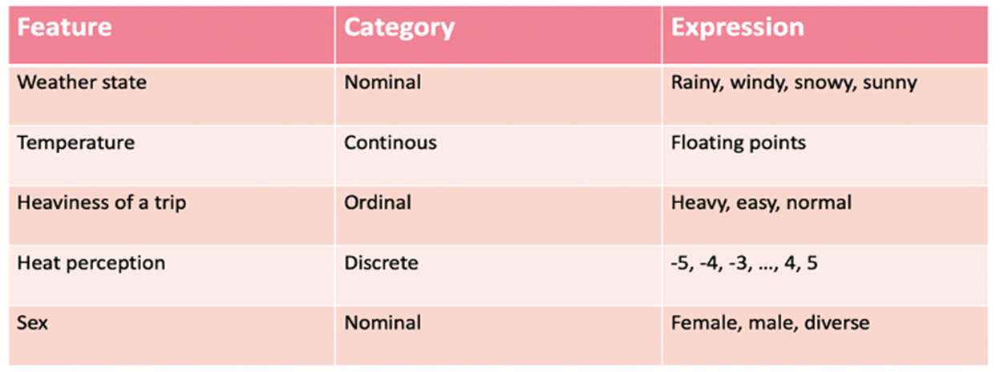
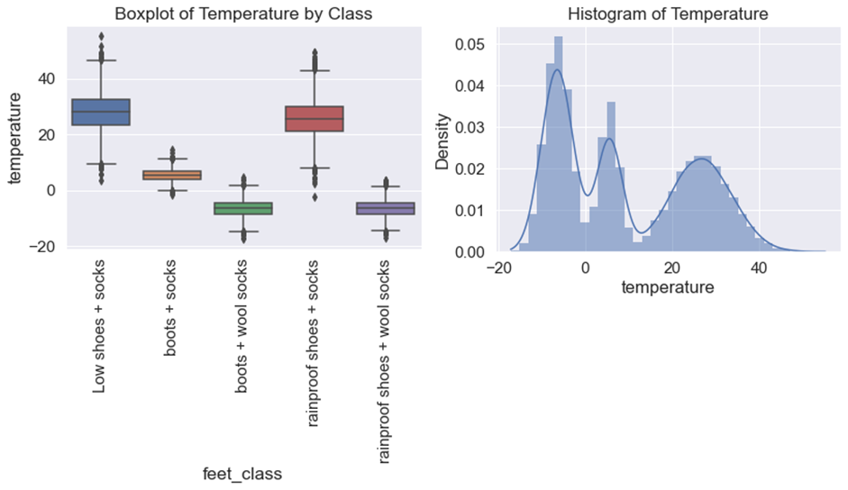

# Blog Post - _Commfy_
_Commfy_ is a mobile app for bike commuters to help them choose suitable bike clothing for their daily rides. _Commfy_ takes the current weather data and its changes throughout the day, as well as the specific routes of each user and his or her personal preferences and characteristics into account. _Commfy_ makes commuting by bike more comfortable and thereby contributes to fostering cycling, reducing traffic and protecting the environment.<br><br>
In an interdisciplinary Tech Labs team, students of tracks User Experience Design (UX), Web Development (WD) and Data Science (DS) developed the digital product _Commfy_ from idea to prototype in an 8-week project phase. The team members organized the project and coordinated themselves in a self-responsible way by using appropriate project management tools, always supported by a clear and trust-based communication. In weekly meetings, work results were discussed and appreciated, coordination needs were identified, and the next steps were planned. In addition to a frequent exchange on Slack, the team organized itself by a shared Kanban board. Team _Commfy_ got support throughout the entire process by their mentors, who provided them with suggestions, critical questions and feedback to guide everyone's learning and the project success.

## Team UX: 
The project started for us, Team UX, with the confirmation of the users' needs as assumed in the project pitch. A survey within a group of 33 participants, including 22 bike commuters, gave us some interesting insights and what features a product like _Commfy_ shall have. The survey’s key findings are:
* A fixed set of locations is fine for most users. (~82%)
* The backpack and the way back/the commute later the day and changing weather is an often mentioned issue. (~41%)
* ***There are commuting people, who actually have a need for an app like _Commfy_.***  (~32%)

We then had to define the project´s MVP within the whole team. We agreed on the development of a functional and user-friendly mobile app that provides clothing recommendations for bike commuters based on the user's favorite routes, weather and personal preferences. Based on the MVP, the UX-team worked out features, structures and content of the digital product.<br><br>


###### _Informational architecture_

<br>The created persona _Marena_, derived from the results of the survey, helped defining and detailing the features and main flows of the app:

* Registration, Login, Logout
* Initial setting of standard routes
* Set up the daily schedule
* Clothing recommendations for each route
* Backpack recommendation for the whole day
* User profile
* Feedback option

<br>


###### _Persona Marena_

<br>The next step covered the wireframing in a low fid quality and the first user tests. Those enabled iterative optimization and detailing, which was found to be very valuable. The basis for the front end development was given. <br><br>


###### _Low fid wireframe_

<br>After completing those user tests, we started high fidelity wireframing. Beside the user friendly design the focus laid on the visual attractiveness of the product. Minor modifications and final design was confirmed by a second loop of user tests.<br><br>


###### _High fid wireframe_<br><br>


## Team WD:

### Front-End
Since it was assumed among the project team that _Commfy_ would be best used on the smartphone / mobile device, WD under the guidance of our mentor made the decision to build a hybrid app using Ionic CLI with integration of the just-learnt React framework.<br>


###### _Ionic+React_<br><br>

<p>Apart from cross-platform applicability, Ionic also offered the advantage of allowing us to begin designing the user interface by making use of the practical and responsive UI Components. Capacitor, a cross-platform app runtime, was chosen as a “bridge” allowing the app to run on a web-browser.</p>
<p>Concerning the programming language, TypeScript was primarily chosen due to the fact that it provides helpful syntax, such as interfaces and enumerated types that help shaping the data and make it less error-prone compared to JavaScript. As such, error handling proved to be more concise and manageable through the precise syntax that TypeScript demanded.
Once the crude structure of the app was decided upon, implementation of the design and functionality meant working around and with the structures that the frameworks natively offered. The learning curve was steep, but once it “clicked”, the decisions to include the respective libraries and frameworks proved fruitful and efficient </p>

### Back-End

<p>The backend part was implemented with Google’s cloud-based Firebase/Firestore. Primarily, Firebase is used to enable an authentication and registration flow for users. Furthermore, Firestore, a document based database and part of Firebase, enables storing and changing user data such as mail address and specific user preferences. As both WD techies chose the front-end course during the academic phase, suddenly being confronted with back-end logic and challenges was certainly a challenge and required adaptability and time-investment. Luckily, under the guidance of the experienced mentors, back-end difficulties were overcome and its logic proved to be less of a frightening obstacle to us, the front-end techies. </p>

<p>Let’s face it, Form handling in React is hard. To alleviate the seemingly capricious nature  of Form handling, e.g. for the signup and registration flow, the library Formik was integrated, and once we were able to understand its advantages and syntax, it proved to be of great value to reach the goal of the MVP.</p>
<p>For state management, a combination of React Query and Jotai proved rather useful. Jotai in particular was a figuratively life-saving inclusion, since its global state management meant we were able to move changing data from component to component without many nasty hiccups. Again, the introduction to these technologies meant that we had to learn a great deal more than what was originally offered in the academic phase, but its outcome was immeasurably useful for us emerging developers.</p>
 <p>There are two major APIs implemented in Commfy. OpenWeatherAPI to display the current weather data in the current location, as well as the DS tracks’s API providing an outfit recommendation based on user input and preferences. To be able to  seamlessly use the APIs and avoid devastating cors policy errors,, CORSmiddleware from the CORS library was used which intercepts the API requests and creates / changes the headers of the response. The logic to display specific icons based on the API results was one of the most rewarding milestones for WD. It effectively combined all relevant learnt technologies and allowed us to apply our knowledge to be rewarded with a visual output. Web Development in a nutshell.</p>

The overall development process is illustrated below. It should also be mentioned that the tasks were not always worked on one after the other, but that work was often done in parallel on different challenges. Team WD decided to split the work based on interests and understanding of the code. This proved to be a successful decision in team communication in order to reach the ambitious goals of the MVP. Through careful coordination, trust in each other’s abilities, and a great deal of motivation, challenges were overcome and the MVP happily reached. Although some bugs remain, some functions are still merely placeholders, and the usability is rather limited due to the lack of responsiveness, the progress we made in such a short time was so unimaginable at the beginning of this bootcamp that this project for us in the WD track can only be considered a success. A great learning experience that we will bring to all pending future projects.  <br><br>


###### _Process Web Dev_<br><br>

## Team DS  
The main tasks of the data science team were to build two distinct models that recommend clothing pieces and feet items for a bike commuter. The latter task was conducted to implement newly-acquired knowledge on machine learning and evaluation into practice. The ultimate purpose of the rule-based model project was to provide the web development team with a working API that recommends clothing items with an accuracy of above 70 percent. This blog will elucidate the path we took to deal with the technical problem and methods we equipped ourselves with to reach the main objectives.  

### Framing analytical strategy
The preparatory work consisted of understanding the business problem and converting it into a technical problem. Thus, after a round of discussion with stakeholders, we understood that bike commuters tend to pick erroneous clothing for the ride that eventually makes the experience of commuting by bike uncomfortable. The leading cause of these problems is the reluctance of bike commuters to find data-driven information to decide what to wear due to the cognitive load and time-consuming nature of such effort. Thus, after brainstorming on possibilities of how things should be and work, we decided to build a digital solution that would recommend appropriate clothing for bike commuters. For the DS team, it meant building a rule-based recommendation model based on the most significant features that will have the most influence on the output. Thus, based on common knowledge, we selected five features to predict thirteen outputs for different body parts. 

### Output data <br>


###### _Output data_<br><br>
### Input data <br>

###### _Input data_<br><br>

### Rule-based model
 
***Data acquisition and exploratory data analysis (EDA)***<br>
After defining the output- and input data, we proceeded with data collection. The data on location and time was consumed from Open Weathermap API with requests library. We invoked the HTTP method Get to retrieve data. Please refer to [this file](https://github.com/TechLabs-Berlin/wt21-commfy/blob/datacleaning_visualisation/DS_Files/Flask_api.py) for more details. Besides, we also created user input data algorithmically to use it as a stand-in to be used for the rule-based recommendation model. 
 
After the data collection, we proceeded with data pre-processing and exploratory data analysis. For this, we conducted a summary of missing data, undertook data cleaning, created a summary table (with df.describe()), plotted bar charts to show frequency of the categories in ‘heaviness of trip’, ‘sex’, weather states and applied box plots for wind speed and temperature data separately. 
 
***Developing rule-based model in python based on the logic of decision trees***<br> 
After reaching the model-ready data quality, we sketched out the system of logical rules by incorporating the selected features to produce the output recommendations. Hence, as the primary logic, we constructed the following arithmetic expression,
```
temp + heatperception – (if female ==2) > current_temp 
```
and compared its outcome to a selected threshold corresponding to a clothing piece. The thresholds were picked based on empirical observation (personal experience) and intuition. For more information on the logic of decision trees, click [here](https://drive.google.com/drive/folders/1VWIDjObwMDKEtCoWnFtMQ8w5VrkkK4r1). 

This exercise helped us effectively lay out the clothing options, which served as a solid foundation for discussing with our stakeholders to find the realistic possibilities and most probable outcomes. After refining the logic of decision trees, we extracted the rules and implemented them in the workbook in python by defining functions and constructing rules with if/else clauses. We developed the rule-based model for multiclass multioutput classification problem. 

***Evaluation of the model from a technical and user perspectives***<br>
We generated fifteen different weather scenarios and trip situations (combination of six features) for hot, warm, breezy, and cold seasons to ask a user to fill in this table with clothing pieces that s/he would pick for given weather conditions. We compared a user’s clothing selections with clothing recommendations from a rule-based model and scored 72%, slightly exceeding the benchmark by 2% on a validation set of 15 weather and trip situations. Afterward, we provided a user with clothing predictions from the rule-based model to evaluate the recommendations on a scale of ‘way too cold’, ‘a little too cold’, ‘just right’, ‘a little too hot’, ‘way too hot’. The successful model achieved a perfect clothing feedback score of above 71% of app uses.

***Deployment of the model with Flask API on PythonAnywhere***<br>
We wanted our model to be available for the web development team so that they can build a Commfy application using it. For this, we built [Flask API](https://github.com/TechLabs-Berlin/wt21-commfy/blob/main/DS_Files/Flask_api.py) and hosted it live on PythonAnywhere (server). It is deployed [here](https://flogreenie.pythonanywhere.com/)

### Predictive ML model for feet items  
***Laying out the groundwork for machine learning project***<br>
We provided relevant data points to our mentor for data collection, derived from the tables on input and output data used for the rule-based model. Our mentor prepared the dataset with user and feature data and the user’s clothing choices. Simultaneously, the DS team created a general structure of the machine learning workbook and brainstormed on evaluation methods. After receiving the dataset, we conducted the initial investigation on data to understand the dataset better. Subsequently, we cleaned and shaped the data for summary statistics and graphical representations. <br><br>



###### _Temperature_<br><br>
 
 ***Model training and evaluation***<br>
After getting familiar with the essential characteristics of data, we proceeded with model training. We fed four ML classifiers with data. These classifiers are K-nearest neighbors, decision tree, random forest, and dummy one.
 
***Dummy classifier***<br>  We applied the ‘most frequent‘ strategy for the dummy classifier. Thus, class ‘4’ is the most frequent one among others classified.
 
***KNN*** <br> The possible hyper-parameters that can be tuned in the K-nn classifier are: 
```
['algorithm', 'leaf_size', 'metric', 'metric_params', 'n_jobs', 'n_neighbors', 'p', 'weights']
```
 
We tuned with the following hyper-parameters:
```
leaf_size = list(range(1,20,2))
n_neighbors = list(range(1,10))
p=[1,2]
```
 
After conducting desktop research on hyper-parameter optimisation in the K-nn classifier, we found that optimisation of the hyper-parameters mentioned above might yield desired model performance. Thus, after tuning all relevant hyper-parameters, the most crucial one turned out to be ‘n_neighbors’ with the best performing value of 8 (neighbors).
 
***Decision-tree***<br>
For the decision tree, the possible hyper-parameters that can be tuned are: 
```
['ccp_alpha', 'class_weight', 'criterion', 'max_depth', 'max_features', 'max_leaf_nodes', 'min_impurity_decrease', 'min_impurity_split', 'min_samples_leaf', 'min_samples_split', 'min_weight_fraction_leaf', 'random_state', 'splitter']
```

Out of these, we opted to tune the following hyper-parameters:
```
n_components = list(range(1,X.shape[1]+1,1)), 
criterion = ['gini', 'entropy'], 
max_depth = list(range(1,15)) 
```

The hyper-parameters –  ``criterion= 'entropy', max_depth= 10, max_features= 4`` – are the best performing set of hyper-parameters among all we tried.<br><br>


###### _tree ml_<br><br>

The tree looks different from the tree we conceptualized for the ruled-based model. This is due to the fact that the max_depth with decision tree algorithm is much higher and thus, labor-intensive and time-consuming for humans to reproduce. 

***Random-forest***<br>
The possible hyper-parameters to optimize for the random forest classifier are:
```
['bootstrap', 'ccp_alpha', 'class_weight', 'criterion', 'max_depth', 'max_features', 'max_leaf_nodes', 'max_samples', 'min_impurity_decrease', 'min_impurity_split', 'min_samples_leaf', 'min_samples_split', 'min_weight_fraction_leaf', 'n_estimators', 'n_jobs', 'oob_score', 'random_state', 'verbose', 'warm_start']
```

We chose to tune these parameters:
```
n_estimators = [5,20,50,100] , random forest
max_features = ['auto', 'sqrt'], max_depth = [int(x) for x in np.linspace(10, 120, num = 12)], min_samples_split = [2, 6, 10], min_samples_leaf = [1, 3, 4], bootstrap = [True, False].
The best performing set of hyper-parameters among all we tried are: n_estimators=100, min_samples_split=6, min_samples_leaf=3, max_features='auto', max_depth=30, bootstrap= False
```
***Evaluation:***<br>
 “In the next step, we plotted the chart comparing accuracy scores of classifiers.<br><br>


###### _Accuracy Score by Classifier_<br><br>

The bar chart shows the accuracy scores by classifiers. Notably, the k-nn outperformed the dummy classifier by far, whereas the decision tree performed slightly better than the knn classifier. The random forest somewhat improved the accuracy performance of the decision tree. 
The main takeaway from the evaluation of classifiers is that the random forest is the best fitting algorithm for our classification problem.
### Way forward 
* Deployment of ML model with Flask API on PythonAnywhere
* CI &CD via  local→github→pythonanywhere

<br>We are happy to have managed a project of this scope as a team. We learned a lot and had a good time together!
